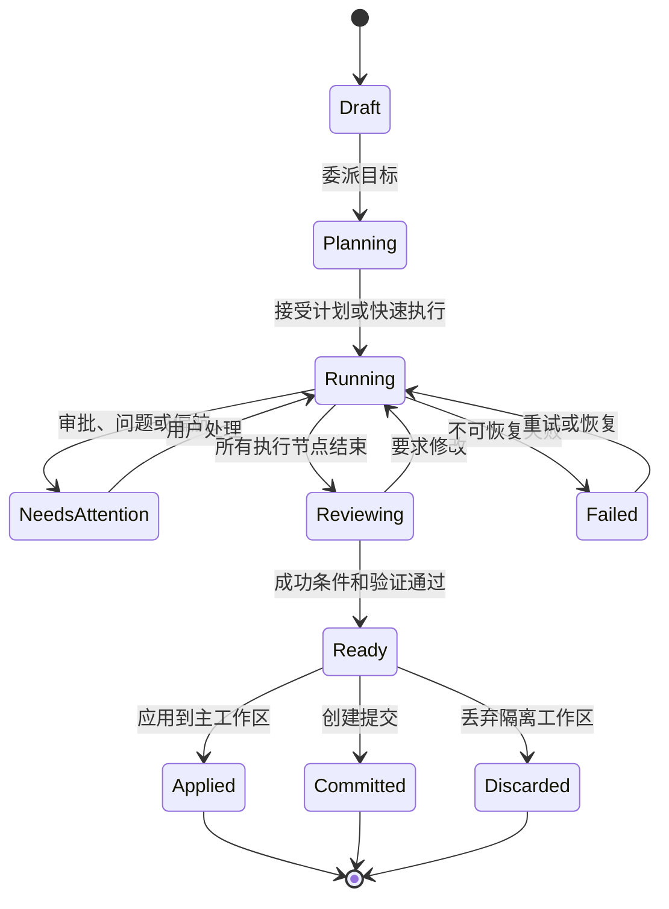
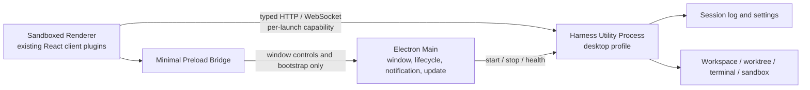

# DeepSeek Harness Desktop Product Design

English | [中文](2026-08-14-deepseek-harness-desktop-design.zh.md)

Status: prototype approved on 2026-08-14; awaiting written-spec review.

## Decision summary

DeepSeek Harness Desktop is a local multi-agent mission control for professional developers. Its default home is not an editor or chat window, but a cross-project task overview where users delegate work, supervise parallel agents, resolve approvals and disagreements, review changes, and deliver results from one window. Harness Studio is a progressive advanced layer that exposes presets, plugins, models, tools, permissions, workflows, and event traces.

The product must let first-time users experience “delegate once, run in parallel, review centrally” within ten minutes. It does not assume that it will replace an existing IDE; instead, it cooperates with the user's current tools through “Open in Editor” and operating-system file associations.

## Target users and core job

The primary users are independent developers and small engineering teams who understand Git, terminals, and code review. They maintain multiple tasks at once, frequently switch to another task while an agent is running, and need to know what the model changed, why the result is acceptable, and whether the verification is trustworthy.

The core job is: given an engineering objective, safely split it across multiple agents for parallel execution, interrupt the user only when judgment is required, and finally deliver an engineering result that is reviewable, verifiable, and mergeable.

Non-target users are developers who only need code completion, non-technical users who need a complete low-code builder, and large teams that depend on centralized enterprise queues and organization-wide governance. The latter two groups can be addressed after the product is stable.

## Competitive research

The research covers standalone desktop applications, agent-first IDEs, agent panels inside traditional IDEs, and open-source local clients. Common trends are that sessions become units of work, Git worktrees provide parallel isolation, change review is separated from chat, and long-running tasks are supervised through status and notifications.

| Product | Product focus | Parallelism and isolation | What to learn | What not to copy |
|---|---|---|---|---|
| [OpenAI Codex Desktop](https://openai.com/index/introducing-the-codex-app/) | Cross-project agent mission control | Independent threads, built-in worktrees, local and remote tasks | Project grouping, thread switching, in-thread diff, background tasks | Equating tasks only with chat threads hides team structure and acceptance criteria |
| [Claude Code Desktop](https://code.claude.com/docs/en/desktop) | Freely arranged agent workbench | Parallel sessions, automatic worktrees, side conversations | Terminals, files, previews, plans, and subagents can all become panels | Free-form layout must not become the default complexity; the first screen still needs stable hierarchy |
| [VS Code Agents Window](https://code.visualstudio.com/docs/agents/agents-window) | Agent-first window alongside the editor | Cross-workspace sessions, local/background/cloud agents, worktrees | One session system across agents and execution locations, plus a right-side Changes panel | The product must not depend on a Copilot account or the Code OSS extension ecosystem |
| [Zed Parallel Agents](https://zed.dev/docs/ai/parallel-agents) | Multi-harness thread management inside an editor | Multiple threads, external agents, terminal threads, optional worktrees | Agent neutrality, project grouping, and equal treatment of terminal threads | A thread list supports switching but does not express a dependency task graph |
| [Google Antigravity](https://blog.google/innovation-and-ai/technology/developers-tools/gemini-3-developers/) | Agent Manager plus IDE and browser | Cross-workspace agents, agent queue, artifacts | Task-level management, browser verification, artifact-driven reporting | Do not make model-ecosystem lock-in a product prerequisite |
| [Kiro](https://kiro.dev/ide/) | Spec-driven agent IDE | Local sandbox, parallel execution, Agent Focus mode | Requirements, design, tasks, and verification form a continuous flow | Requiring a complete spec for every task would slow small fixes |
| [Cursor Background Agents](https://docs.cursor.com/background-agent) | IDE plus remote asynchronous agents | Remote Ubuntu environment, background list, takeover | Background status, follow-up, and takeover | A local-first product must not make remote data retention the default |
| [Windsurf Worktrees](https://docs.windsurf.com/windsurf/cascade/worktrees) | Cascade inside an IDE | Each conversation can use an independent worktree | Lightweight isolation and independent build/test execution | Worktrees cannot be only an advanced toggle beside the prompt box |
| [GitHub Copilot Coding Agent](https://docs.github.com/en/copilot/how-tos/use-copilot-agents/cloud-agent/start-copilot-sessions) | Asynchronous issue-to-pull-request delivery | GitHub cloud environment, session logs, and pull requests | Outcome orientation and a natural review boundary | The MVP must not require GitHub issues, pull requests, or cloud execution |
| [JetBrains Junie](https://www.jetbrains.com/help/ai-assistant/junie-agent.html) | Single-agent execution with deep IDE context | Planning, terminal, change rollback, remote access | IDE context, per-file rollback, permission modes | A single chat panel cannot support a multi-agent mission control |
| [Gemini Code Assist Agent Mode](https://developers.google.com/gemini-code-assist/docs/agent-mode) | Planning and tool execution in VS Code/IntelliJ | Plan approval, tool permissions, MCP, and IDE context | Editable plans, context drawer, clear permissions | Plans and tool calls still do not replace a cross-task view |
| [Cline](https://docs.cline.bot/core-workflows/task-management) | Self-contained tasks with stepwise approval | Per-task history, cost, breakpoints, and checkpoints | One objective per task, recovery, and visible cost | Per-tool approval creates supervision fatigue and should be consolidated by risk policy |
| [Roo Code](https://roocodeinc.github.io/Roo-Code/basic-usage/using-modes/) | Specialist modes and orchestration mode | Orchestrator delegates to specialist modes, shadow Git checkpoints | Modes map to tool permissions and non-destructive recovery | Modes should not become a product taxonomy users must learn first |
| [OpenHands](https://docs.openhands.dev/overview/introduction) | General software agent in a sandbox | Docker/remote sandbox and local GUI | Open source, local deployment, environment isolation | Container operations must not be a prerequisite for first desktop launch |
| [Trae SOLO](https://www.trae.cn/solo) | AI-led end-to-end development | Multi-agent collaboration and tool scheduling | Autonomous progress toward an outcome | Black-box “full automation” would weaken DeepSeek Harness's transparency advantage |
| [OpenCode](https://dev.opencode.ai/docs/agents/) | Configurable primary agents and subagents in a TUI/desktop app | Sessions, primary agents, subagents, tool permissions | Open models and specialist agent configuration | Leading with configuration raises the entry barrier for new users |

## Market opportunity

Mainstream products have already validated that multiple sessions, worktrees, diffs, and terminals are foundational. Differentiation no longer comes from whether parallelism is possible, but from whether users can retain judgment as the scale of parallel work grows.

DeepSeek Harness can turn runtime transparency into a product capability: users can supervise tasks like Codex Desktop and, when needed, see how a task was assembled from a preset, plugins, tools, permissions, workflows, and subagents. Competitors usually show only execution results or a limited tool log; Harness can expose a reproducible runtime configuration and complete event trace.

## Product principles

1. **Task first.** A session is the record carrier; a task is the user's unit of work with an objective, status, success criteria, and delivery package.
2. **Isolate by default.** Parallel agents that write files use independent Git worktrees; only read-only research tasks share a workspace.
3. **Supervise by exception.** Users handle only approvals, questions, drift, failures, and review-ready results rather than continuously watching logs.
4. **Transparent without noise.** Conclusions and progress are visible by default; tool calls, context, events, and the plugin graph expand in layers.
5. **Completion must be verifiable.** A task cannot display “Complete” without success criteria, a diff, verification evidence, and an unresolved-risk count.
6. **Local first.** Workspaces, credentials, logs, and execution remain on the user's machine by default; remote execution is an explicit later capability.
7. **Cooperate with existing tools.** The desktop app delegates and supervises work without forcing users to abandon VS Code, JetBrains, Zed, or the terminal.

## Information architecture

Global navigation contains Tasks, Workspaces, Automations, Harness Studio, and Settings. Tasks is the default home; Workspaces manages local directories, Git state, and recent activity; Automations hosts scheduled and event-triggered workflows; Harness Studio manages runtime composition; Settings contains only device- and account-level preferences.

The Tasks page has four regions: a 56px global navigation rail, a 220–260px cross-project task list, a flexible task workspace, and a 260–320px task inspector. At narrower widths, the inspector becomes a drawer; the task list remains because switching among parallel tasks is a core operation.

Harness Studio is not a separate development tool, but a deeper destination from the task inspector. When a user enters Studio from a task's preset, tools, permissions, or event summary, Studio automatically opens that task's runtime snapshot.

## Core objects

| Object | Definition | Data source |
|---|---|---|
| Task | One user-delegated objective; maps one-to-one to a root Session in the MVP | Root Session log and task projection |
| Agent Run | An execution instance of the root agent or a subagent | Session tree and subagent lifecycle |
| Execution Workspace | Project directory or isolated worktree a task can read and write | Workspace registry and new local worktree provider |
| Attention Item | An approval, question, failure, conflict, or review-ready state that requires user intervention | Projections of interaction, approval, workflow, test, and review events |
| Artifact | Plans, changes, test reports, screenshots, delivery files, and decision records | Session events and deliverable service |
| Review Package | Aggregate of success criteria, diff, verification evidence, risks, and branch | Generated on demand from the Task projection |
| Runtime Snapshot | The preset, plugins, model, tools, and permissions actually used when the task started | Composed agent configuration and event log |

The MVP does not create a second task history independent of the Session log. The Task service derives state from the root Session, child Sessions, and existing events; it adds a SessionEvent only when a genuinely new persistent fact is needed. Recovery, replay, export, and telemetry therefore continue to share one source of truth.

## Task lifecycle

Creating a task requires only selecting a project and describing an objective. Based on whether the task will modify files, repository state, and its concurrency plan, the system recommends an isolation strategy and generates success criteria and an agent task graph. Small tasks may skip explicit plan confirmation, but still retain generated success criteria.

During execution, the central area shows the agent task graph, current activity, terminal summary, and key artifacts. The user can append instructions to the whole task or target an executor with `@Agent`. Injected instructions use the existing steering/queue semantics rather than inventing a new synchronous chat channel.

One root Task owns one integration worktree. Read-only subagents may share a snapshot of that worktree; by default, only one writing agent directly modifies the integration worktree. When the task graph genuinely requires multiple writing agents in parallel, each writing agent uses a child worktree created from the same base, and a separate Integration node merges the results into the task's integration worktree. Path declarations can detect overlap early but cannot replace Git merge and verification.

The attention queue aggregates blockers across projects and sorts them by risk, wait time, and task priority. High-risk commands, irreversible operations, and out-of-scope writes are confirmed individually; similar low-risk actions can be allowed in batches through permission policy. Clicking a notification opens the corresponding item directly rather than merely opening the task home.

The review phase shows success-criteria completion, file diffs, verification commands and output, reviewer conclusions, unresolved risks, and the worktree branch. Users can accept per file or hunk, request agent revisions, apply changes to the current workspace, create a commit, or discard the task.

## Page definitions

### Task overview

The task overview is organized into “Needs You,” “Running,” and “Recently Completed,” rather than ordered by chat time. A task card shows only the project, objective, status, wait time, agent count, changes, and verification summary. Failures and items awaiting intervention rank above ordinary running states.

The empty state guides users to add a workspace, configure a model, and delegate the first task. The home screen does not show a plugin marketplace, model leaderboard, or marketing content.

### Single-task workspace

The header fixes the task title, worktree, model, runtime, and pause/stop controls in place. The main area shows the task graph by default; terminal, files, plan, preview, and conversation are task panels that can be switched or arranged side by side. Layout is adjustable, but stable “Supervise,” “Code,” and “Review” presets are provided.

The right inspector shows current attention items, success criteria, artifacts, and a Harness summary. Advanced data appears as counts and states, such as “12 tools / workspace-write / 284 events,” and opens Studio when selected.

### Change review

Review is a separate work mode rather than content buried inside chat messages. It has a file tree on the left, unified diff in the center, and verification and risk conclusions on the right. Changes remain attributable to each agent, but the default view presents the final task result as a whole so users need not understand internal collaboration before reviewing it.

### Harness Studio

Studio contains Presets, the plugin graph, model routing, tools and permissions, workflows, event streams, and runtime diagnostics. It opens the current task snapshot in read-only mode by default; edits clearly distinguish between “change configuration for future tasks” and “restart this empty task.” A Session that has executed cannot hot-swap its preset.

### Workspaces and settings

The Workspaces page manages directories, default branches, worktrees, environment detection, project instructions, and default presets. Settings manages theme, language, notifications, model credentials, update channel, and data retention. Credentials show only their source and whether they are configured, never the key itself.

## Visual and interaction system

The visual system is defined by [DESIGN.md](../../../DESIGN.md). The default dark theme uses cool gray-black surfaces, thin borders, and mint green as the primary accent; blue communicates review and information, amber signals required intervention, and red is reserved for failure or high risk. Source Sans 3 handles Chinese and interface text, IBM Plex Mono handles status, time, branches, events, and code, and both fonts ship locally with the application.

The interface maintains high information density without large colored cards, purple gradients, uniformly oversized corner radii, or meaningless animation. Every state also has text or an icon; keyboard focus is visible; system zoom, reduced motion, dark/light themes, and complete keyboard navigation are supported.

## Desktop architecture

The desktop app uses a thin Electron shell rather than rewriting Harness or exposing Node APIs to the React renderer. The existing TypeScript Host and plugin composition run in an Electron `utilityProcess`; the existing React Web UI remains a sandboxed Renderer; Electron Main handles only window lifecycle, process supervision, notifications, deep links, updates, and constrained system integration.

Electron is selected because the repository's Host, PTY, plugins, and client build are all Node/TypeScript, so Electron can execute these modules directly and reuse existing bundles. Tauri would require an additional Node sidecar, a dual Rust/Node runtime, and a new IPC path without removing Harness's Node dependency; a plain browser wrapper would lack reliable process supervision, notifications, updates, and secure system integration.

The desktop Renderer sets `nodeIntegration: false`, `contextIsolation: true`, and `sandbox: true`, and loads only packaged application content. Preload does not expose `ipcRenderer` or a generic `send`; it exposes only parameter-validated window controls, notification preferences, and one-time connection bootstrap. Every Electron IPC call validates its sender; external links open through Main only after HTTPS URL validation.

The Harness process listens on a random loopback port and requires a high-entropy capability generated by Main for each launch. HTTP uses an authorization header, while WebSocket uses an equivalent capability in a supported subprotocol; the Host also validates Origin. The capability is never written to logs, URLs, settings, or Session events. A Renderer crash does not terminate running tasks; Main detects a Harness-process crash and offers recovery in the UI instead of silently restarting it and pretending tasks are still running.

Closing a window and quitting the application are separate actions. When tasks are running, closing the last window leaves Main and Harness active in the system tray or macOS menu bar by default; completion and attention-required events send notifications. Explicit Quit states how many tasks are still running and offers Continue in Background, Stop and Quit, or Cancel. After an abnormal exit, tasks recover to accurate interrupted, failed, or settled states without replaying unconfirmed tool calls.

A new desktop profile extends the existing web-app bundle with desktop connection validation, native directory selection, system path opening, notifications, task projection, and a local worktree provider. All user-facing capabilities remain plugin-registered; the Electron shell does not become a business-logic container that bypasses Cordis.

Proposed source ownership is:

- `apps/desktop/`: Electron entry points, packaging, signing, and installer configuration.
- A new desktop shell package under `packages/desktop/`: Main, Preload, Harness process supervision, and narrow IPC definitions.
- `packages/bundle/desktop-app/`: desktop profile composition and runtime closure.
- `packages/task/task/`: service definitions for Task projection, state, success criteria, attention, and review packages.
- `packages/task/worktree-local/`: Git worktree lifecycle and recovery implementation.
- `packages/host/apiproxy/`: new `task.*` queries, actions, and real-time projection transport.
- `packages/client/runtime/`: Task object layer and reconnect baseline.
- Independent `packages/client/ui-*` plugins: task overview, task graph, attention, review, and Studio presentation.

## Git worktree rules

Parallel tasks that modify files create application-owned worktrees by default under Harness home so the repository root remains clean. A task records the base commit, branch, main-workspace dirty state, and worktree path. Before creation, the app checks Git version, repository state, nested repositories, and available file-system space; on failure, it explains the cause and lets the user choose direct-workspace mode instead of silently downgrading.

The root-task worktree is the final location for review and delivery. Child worktrees for parallel writing subagents live only for their corresponding nodes and merge into the root-task worktree through an Integration node; merge conflicts, test failures, or base movement block the task and enter the attention queue. Ordinary subagents are read-only by default to avoid meaningless branches for research and review work.

Apply, Commit, and Discard are all explicit actions. Before Apply, the app revalidates the relationship between the main workspace and the base; conflicts enter the review flow without a destructive reset. Archiving a task can preserve its branch while releasing the worktree; before deletion, the app explains whether branches and uncommitted changes are recoverable.

## MVP scope

The MVP includes local desktop applications for Windows x64 and macOS arm64; local directories and Git projects; a cross-project task overview; multiple parallel root tasks; multiple subagents within one task; default worktree isolation; a unified attention queue; terminal, plan, file, and diff views; success criteria and verification evidence; desktop notifications; read-only Harness Studio inspection; model and credential settings; crash recovery; and application updates.

The MVP excludes cloud execution, mobile handoff, SSH remote hosts, computer control, built-in browser automation, team sharing, organization policy center, plugin marketplace, and automatic pull-request creation. Interfaces may anticipate these capabilities, but they must not delay the local closed loop.

## Success metrics

- Median time from first launch to the first running task is under five minutes.
- At least 40% of new users successfully start two parallel tasks in their first session.
- 80% of blocked items are resolved directly from the attention queue without locating the original log.
- 90% of tasks marked “Complete” include at least one readable piece of verification evidence.
- Worktree-caused accidental modifications to the user's main workspace remain at zero.
- After a crash or application restart, every persistent task returns to the correct state without repeated tool execution.

## Errors and recovery

Model or tool failures retain the last successful node and offer Retry, Change Model, or End Task; retry must not repeat non-idempotent actions that already committed. When an approval expires, the task enters Needs Attention and states whether the original action is still valid. When a process disconnects, the UI distinguishes Renderer reconnection, Harness restart, and Agent Run failure.

If worktree creation, application, or cleanup fails, the app preserves the directory and diagnostics rather than force-deleting automatically. Settings conflicts use the existing revision mechanism and prompt users to reload before saving again. Credential errors identify only the provider and repair entry point, never the key or complete request.

## Verification strategy

Task projection, the state machine, attention ordering, and the worktree lifecycle use unit tests and fault injection. Each UI plugin uses pure-props component tests; assembled user flows add keyless Web replay snapshots. Electron uses Playwright's Electron driver to cover first launch, window restoration, Renderer reload, Harness-process exit, notification deep links, update prompts, and capability rejection.

Every user-visible flow has at least one real assembled example and snapshot: creating parallel tasks, handling an approval, completing a subagent, entering review, applying a worktree, and recovering from failure. Windows and macOS CI verify installation, launch of signed artifacts, and baseline PTY behavior; Linux remains buildable before product support but is not claimed as available.

## Risks

- If Task projection becomes a second source of truth, it will drift from Session logs; implementation must derive it from events and registries and test replay against real-time results for consistency.
- Electron increases distribution size and creates responsibility for Chromium updates; automatic updates, signing, and security upgrades must be part of the release flow rather than a post-launch addition.
- Parallel execution by default increases API cost and machine load; the task creator must show concurrency limits, and the scheduler must obey global and project budgets.
- Harness Studio could turn the product into a configuration console; the default task flow must never require understanding Cordis, presets, or the plugin graph.
- Worktrees cannot cover non-Git directories, extremely large repositories, and unusual submodule layouts; direct-workspace mode needs complete risk messaging and recovery mechanisms.

## Final product judgment

DeepSeek Harness Desktop should be neither another editor with a chat sidebar nor a debugging console only for Harness authors. Its primary product is multi-agent task supervision; its distinctive moat is an inspectable, reproducible, composable Harness runtime. The task console gives ordinary developers immediate value, while Harness Studio gives advanced users confidence in and extensibility over the system.
