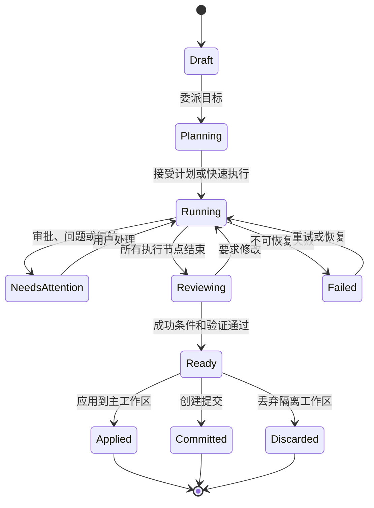
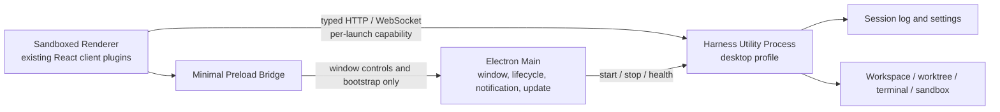

# DeepSeek Harness Desktop 产品设计

[English](2026-08-14-deepseek-harness-desktop-design.md) | 中文

状态：2026-08-14 原型已确认，等待书面规格复核。

## 决策摘要

DeepSeek Harness Desktop 定位为面向专业开发者的本地多 Agent 指挥中心。默认首页不是编辑器或聊天窗口，而是跨项目任务总览；用户在一个窗口内委派任务、监督并行 Agent、处理审批和分歧、审查变更并交付结果。Harness Studio 作为渐进式高级层展示 Preset、插件、模型、工具、权限、工作流和事件轨迹。

产品必须让首次使用者在十分钟内感受到“一次委派，多路并行，集中验收”。它不以替代现有 IDE 为前提，而是通过“在编辑器中打开”和系统文件关联与用户现有工具协作。

## 目标用户与核心工作

第一目标用户是熟悉 Git、终端和代码审查的独立开发者与小型工程团队。他们同时维护多个任务，经常在一个 Agent 运行时切换到另一个任务，并且需要确认模型改了什么、为什么可接受、验证是否可信。

核心工作是：给定一个工程目标，安全地将它拆给多个 Agent 并行完成，只在需要判断时打断用户，最后交付可审查、可验证、可合并的工程结果。

非目标用户是只需要代码补全的开发者、需要完整低代码搭建器的非技术用户，以及依赖集中式企业队列和组织级治理的大型团队。后两类可在产品稳定后扩展。

## 竞品研究

研究覆盖独立桌面应用、Agent-first IDE、传统 IDE 中的 Agent 面板和开源本地客户端。共同趋势是：会话成为工作单元、Git worktree 成为并行隔离手段、变更审查从聊天中独立出来、长任务以状态与通知驱动监督。

| 产品 | 产品重心 | 并行与隔离 | 可借鉴点 | 不应照搬 |
|---|---|---|---|---|
| [OpenAI Codex Desktop](https://openai.com/index/introducing-the-codex-app/) | 跨项目 Agent 指挥中心 | 独立线程、内建 worktree、本地与远程任务 | 项目分组、线程切换、线程内 Diff、后台任务 | 仅把任务等同聊天线程会隐藏团队结构与验收条件 |
| [Claude Code Desktop](https://code.claude.com/docs/en/desktop) | 可自由排布的 Agent 工作台 | 并行会话、自动 worktree、侧聊 | 终端、文件、预览、计划、子 Agent 均可成为面板 | 自由布局不能成为默认复杂度，首屏仍需稳定层级 |
| [VS Code Agents Window](https://code.visualstudio.com/docs/agents/agents-window) | 与编辑器并列的 Agent-first 窗口 | 跨工作区会话、本地/后台/云 Agent、worktree | 一个会话体系跨 Agent 与运行位置、右侧 Changes 面板 | 不依赖 Copilot 账户或 Code OSS 扩展生态来成立 |
| [Zed Parallel Agents](https://zed.dev/docs/ai/parallel-agents) | 编辑器内多 Harness 线程管理 | 多线程、外部 Agent、终端线程、可选 worktree | Agent 无关、项目分组、终端线程同等对待 | 线程列表适合切换，不足以表达依赖任务图 |
| [Google Antigravity](https://blog.google/innovation-and-ai/technology/developers-tools/gemini-3-developers/) | Agent Manager 加 IDE 与浏览器 | 跨工作区 Agent、Agent 队列、工件 | 任务级管理、浏览器验证、工件驱动汇报 | 不把模型生态绑定变成桌面端的产品前提 |
| [Kiro](https://kiro.dev/ide/) | 规范驱动的 Agent IDE | 本地沙箱、并行执行、Agent focus mode | 需求、设计、任务和验证形成连续流程 | 所有任务强制完整 Spec 会拖慢小修复 |
| [Cursor Background Agents](https://docs.cursor.com/background-agent) | IDE 加远程异步 Agent | 远程 Ubuntu 环境、后台列表、可接管 | 后台状态、跟进、接管 | 本地优先产品不能以远程数据保留为默认 |
| [Windsurf Worktrees](https://docs.windsurf.com/windsurf/cascade/worktrees) | IDE 内 Cascade | 每段对话可使用独立 worktree | 轻量开启隔离和独立构建测试 | Worktree 不能只是输入框旁的高级开关 |
| [GitHub Copilot Coding Agent](https://docs.github.com/en/copilot/how-tos/use-copilot-agents/cloud-agent/start-copilot-sessions) | Issue 到 Pull Request 的云端异步交付 | GitHub 云环境、Session 日志与 PR | 结果导向、天然审查边界 | MVP 不把 GitHub Issue、PR 或云执行设为必需 |
| [JetBrains Junie](https://www.jetbrains.com/help/ai-assistant/junie-agent.html) | IDE 深度上下文中的单 Agent 执行 | 计划、终端、改动回滚、远程接入 | IDE 上下文、逐文件回滚、权限模式 | 单聊天面板无法承载多 Agent 指挥中心 |
| [Gemini Code Assist Agent Mode](https://developers.google.com/gemini-code-assist/docs/agent-mode) | VS Code/IntelliJ 中的计划与工具执行 | 计划审批、工具权限、MCP 与 IDE 上下文 | 计划可编辑、上下文抽屉、权限清晰 | 计划与工具调用仍不能替代跨任务视图 |
| [Cline](https://docs.cline.bot/core-workflows/task-management) | 自包含任务和逐步批准 | 每任务历史、成本、断点与检查点 | 一任务一目标、恢复与成本可见 | 逐工具批准会造成监督疲劳，应由风险策略汇总 |
| [Roo Code](https://roocodeinc.github.io/Roo-Code/basic-usage/using-modes/) | 专业模式与编排模式 | Orchestrator 委派到专业模式，影子 Git 检查点 | 模式对应工具权限、非破坏恢复 | 模式不应成为用户必须先学习的产品分类学 |
| [OpenHands](https://docs.openhands.dev/overview/introduction) | 沙箱中的通用软件 Agent | Docker/远程沙箱、本地 GUI | 开源、本地部署、环境隔离 | 容器运维不应成为桌面首次启动的前置条件 |
| [Trae SOLO](https://www.trae.cn/solo) | AI 主导的端到端开发 | 多 Agent 协作与工具调度 | 面向结果的自主推进 | 黑盒“全自动”会削弱 DeepSeek Harness 的透明优势 |
| [OpenCode](https://dev.opencode.ai/docs/agents/) | TUI/桌面中的可配置主 Agent 与子 Agent | 会话、主 Agent、子 Agent、工具权限 | 开放模型与专业 Agent 配置 | 以配置为首屏会提高新用户门槛 |

## 市场机会

主流产品已经验证“多会话、worktree、Diff、终端”是基础能力，差异不再来自是否能并行，而来自用户能否在并行规模扩大后保持判断力。

DeepSeek Harness 的机会是把运行时透明度变成产品能力：用户既能像 Codex Desktop 一样监督任务，也能在需要时看到任务如何由 Preset、插件、工具、权限、工作流与子 Agent 组合而成。竞品通常只展示执行结果或少量工具日志，Harness 可以展示可复现的运行配置与完整事件轨迹。

## 产品原则

1. **任务优先。** 会话是记录载体，任务是有目标、状态、成功条件和交付包的用户工作单元。
2. **默认隔离。** 会写文件的并行 Agent 使用独立 Git worktree；只读研究任务才共享工作区。
3. **异常驱动监督。** 用户只处理审批、问题、偏航、失败和待审查结果，不需要持续盯住日志。
4. **透明但不嘈杂。** 默认显示结论和进度；工具调用、上下文、事件与插件图按层级展开。
5. **完成必须可验证。** 没有成功条件、Diff、验证证据和未解决风险统计的任务不能显示“完成”。
6. **本地优先。** 工作区、凭据、日志和执行默认留在用户机器；远程执行是显式的后续能力。
7. **与现有工具协作。** 桌面端负责委派与监督，不强迫用户放弃 VS Code、JetBrains、Zed 或终端。

## 信息架构

全局导航包含任务、工作区、自动化、Harness Studio 和设置。任务是默认首页；工作区管理本地目录、Git 状态和最近活动；自动化承载定时与事件触发工作流；Harness Studio 管理运行时组合；设置只放设备与账户级偏好。

任务页采用四区布局：56px 全局导航、220–260px 跨项目任务列表、弹性任务工作区、260–320px 任务检查器。窗口变窄时，检查器变成抽屉；任务列表保持存在，因为并行任务切换是核心操作。

Harness Studio 不是单独的开发工具，而是任务检查器的深层目的地。用户从具体任务的 Preset、工具、权限或事件摘要进入 Studio，Studio 自动定位到该任务的运行时快照。

## 核心对象

| 对象 | 定义 | 数据来源 |
|---|---|---|
| Task | 用户委派的一项目标；MVP 与一个根 Session 一一对应 | 根 Session 日志与任务投影 |
| Agent Run | 根 Agent 或一个子 Agent 的执行实例 | Session 树与 subagent 生命周期 |
| Execution Workspace | 任务可读写的项目目录或隔离 worktree | Workspace 注册表与新的本地 worktree provider |
| Attention Item | 需要用户介入的审批、问题、失败、冲突或待审查状态 | interaction、approval、workflow、test 与 review 投影 |
| Artifact | 计划、变更、测试报告、截图、交付文件和决策记录 | Session 事件与 deliverable 服务 |
| Review Package | 成功条件、Diff、验证证据、风险和分支的汇总 | Task 投影按需生成 |
| Runtime Snapshot | 任务启动时采用的 Preset、插件、模型、工具与权限事实 | 组合后的 Agent 配置与事件日志 |

MVP 不创建独立于 Session 日志的第二套任务历史。Task 服务从根 Session、子 Session 和已有事件派生状态；确有新持久事实时才新增 SessionEvent。这样恢复、回放、导出和遥测继续共享一个事实来源。

## 任务生命周期

创建任务只要求用户选择项目并描述目标。系统根据任务是否会修改文件、仓库状态和并发计划建议隔离方式，生成成功条件和 Agent 任务图。小任务允许跳过显式计划确认，但仍保存生成的成功条件。

执行期间，中央区域显示 Agent 任务图、当前活动、终端摘要和关键工件。用户可以向整个任务追加指令，也可以通过 `@Agent` 指定执行者。插入指令采用现有 steering/queue 语义，不伪造新的同步聊天通道。

一个根 Task 拥有一个集成 worktree。只读子 Agent 可以共享该 worktree 的快照；默认只有一个写 Agent直接修改集成 worktree。任务图确实需要多个写 Agent 并行时，每个写 Agent 使用从同一基准创建的子 worktree，随后由单独的 Integration 节点将结果合入任务的集成 worktree。路径声明只能用于提前发现重叠，不能替代 Git 合并与验证。

注意力队列跨项目汇总阻塞事项，按风险、等待时长和任务优先级排序。高风险命令、不可逆操作和任务范围外写入逐项确认；同类低风险动作可通过权限策略批量允许。通知点击后直接打开对应事项，不只打开任务首页。

审查阶段展示成功条件完成度、文件 Diff、验证命令和输出、Reviewer 结论、未解决风险与 worktree 分支。用户可逐文件或逐 hunk 接受，要求 Agent 修改，应用到当前工作区，创建提交，或丢弃任务。

## 页面定义

### 任务总览

任务总览按“需要你”“正在运行”“最近完成”组织，而不是按聊天时间排序。任务卡只展示项目、目标、状态、等待时间、Agent 数、变更与验证摘要。失败和等待介入优先于普通运行状态。

空状态引导用户添加工作区、配置模型并委派第一个任务。首页不展示插件市场、模型榜单或营销内容。

### 单任务工作区

顶部固定任务标题、worktree、模型、运行时长和暂停/停止操作。主区域默认展示任务图；终端、文件、计划、预览和对话作为可切换或并排的任务面板。布局可调整，但提供稳定的“监督”“编码”“审查”三个预设布局。

右侧检查器展示当前注意事项、成功条件、工件和 Harness 摘要。高级数据以数量与状态概括，例如“12 tools / workspace-write / 284 events”，点击后进入 Studio。

### 变更审查

审查页是独立工作模式，不埋在聊天消息中。左侧文件树，中央统一 Diff，右侧验证与风险结论。每个 Agent 产生的变更可追溯，但默认以任务最终结果合并展示，避免用户理解内部协作后才能审查。

### Harness Studio

Studio 包含 Preset、插件图、模型路由、工具与权限、工作流、事件流和运行诊断。默认只读查看当前任务快照；编辑操作明确区分“修改以后任务的配置”和“重启当前空白任务”，运行过的 Session 不允许热换 Preset。

### 工作区与设置

工作区页面管理目录、默认分支、worktree、环境检测、项目说明和默认 Preset。设置页面管理主题、语言、通知、模型凭据、更新渠道和数据保留。凭据只显示来源与是否已配置，不回显密钥。

## 视觉与交互系统

视觉系统以 [DESIGN.md](../../../DESIGN.md) 为准。默认深色主题采用冷灰黑背景、薄边框和薄荷绿主强调色；蓝色表示审查与信息，琥珀色表示需要介入，红色只表示失败或高风险。Source Sans 3 负责中文和界面文本，IBM Plex Mono 负责状态、时间、分支、事件和代码，两者随应用本地打包。

界面保持高信息密度，但不使用大面积彩色卡片、紫色渐变、统一大圆角或无意义动画。所有状态同时提供文字或图标；键盘焦点可见；支持系统缩放、减少动画、深浅主题和完整键盘导航。

## 桌面技术架构

桌面端采用 Electron 薄壳，而不是重写 Harness 或将 Node API 放入 React 渲染进程。现有 TypeScript Host 与插件组合运行在 Electron `utilityProcess` 中；现有 React Web UI 继续作为沙箱 Renderer；Electron Main 只负责窗口生命周期、进程监管、通知、深链接、更新和受限系统集成。

选择 Electron 的原因是仓库的 Host、PTY、插件和客户端构建均为 Node/TypeScript，Electron 可以直接运行这些模块并复用现有打包产物。Tauri 需要额外捆绑 Node sidecar、维护 Rust/Node 双运行时和新的 IPC 路径，却不能减少 Harness 本身的 Node 依赖；纯浏览器包装则缺少可靠的进程监管、通知、更新和安全的系统集成。

桌面 Renderer 设置 `nodeIntegration: false`、`contextIsolation: true` 和 `sandbox: true`，只加载应用打包内容。Preload 不暴露 `ipcRenderer` 或通用 `send`，只暴露经过参数验证的窗口控制、通知偏好和一次性连接引导。所有 Electron IPC 校验发送方；外部链接只允许通过 Main 打开验证后的 HTTPS URL。

Harness 进程监听随机 loopback 端口，并要求 Main 每次启动生成的高熵 capability。HTTP 使用授权头，WebSocket 使用受支持的子协议携带等价能力；Host 同时校验 Origin。能力不写入日志、URL、设置或 Session 事件。Renderer 崩溃不会终止运行任务；Harness 进程崩溃会被 Main 检测并在 UI 中提供恢复，而不是静默重启并假装任务仍在运行。

窗口关闭与应用退出是两个动作。有运行任务时，关闭最后一个窗口默认保留 Main 与 Harness 进程并进入系统托盘或 macOS 菜单栏；任务完成或需要介入时发送通知。显式退出会说明仍在运行的任务数量，并提供继续后台运行、停止后退出或取消。异常退出后的任务恢复为准确的 interrupted、failed 或 settled 状态，不自动重放未确认的工具调用。

新的 desktop profile 叠加现有 web-app bundle，增加桌面连接验证、原生目录选择、系统路径打开、通知、任务投影和本地 worktree provider。所有用户功能仍按插件注册；Electron 壳不成为绕开 Cordis 的业务逻辑容器。

建议的源码所有权如下：

- `apps/desktop/`：Electron 入口、打包、签名和安装器配置。
- `packages/desktop/` 下拟新增的桌面壳包：Main、Preload、Harness 进程监管和窄 IPC 定义。
- `packages/bundle/desktop-app/`：desktop profile 组合与运行时闭包。
- `packages/task/task/`：Task 投影、状态、成功条件、注意力与审查包的服务定义。
- `packages/task/worktree-local/`：Git worktree 生命周期与恢复实现。
- `packages/host/apiproxy/`：新增 `task.*` 查询、操作和实时投影传输。
- `packages/client/runtime/`：Task 对象层与重连基线。
- 独立 `packages/client/ui-*` 插件：任务总览、任务图、注意力、审查和 Studio 展示。

## Git worktree 规则

修改文件的并行任务默认创建应用拥有的 worktree，目录位于 Harness home 下，不污染仓库根目录。任务记录基准提交、分支、主工作区脏状态和 worktree 路径。创建前检查 Git 版本、仓库状态、嵌套仓库和文件系统可用空间；失败时解释原因并允许用户选择直接工作区模式，而不是自动降级。

根任务 worktree 是最终审查与交付的位置。并行写子 Agent 的子 worktree 只在对应节点存活，并通过 Integration 节点合入根任务 worktree；合并冲突、测试失败或基准移动都会阻塞任务并进入注意力队列。普通子 Agent 默认为只读，避免为研究和评审工作制造无意义的分支。

应用、提交和丢弃都是显式动作。应用前重新验证主工作区与基准关系；出现冲突时进入审查流程，不执行破坏性 reset。归档任务可以保留分支但释放 worktree；删除任务前说明分支和未提交变更是否可恢复。

## MVP 范围

MVP 包含 Windows x64 与 macOS arm64 的本地桌面应用、本地目录与 Git 项目、跨项目任务总览、多个并行根任务、一个任务内的多个子 Agent、默认 worktree 隔离、统一注意力队列、终端、计划、文件与 Diff、成功条件与验证证据、桌面通知、Harness Studio 只读检查、模型和凭据设置、崩溃恢复与应用更新。

MVP 不包含云端执行、手机接力、SSH 远程主机、计算机控制、内建浏览器自动操作、团队共享、组织策略中心、插件市场和自动创建 Pull Request。这些能力的接口可以预留，但不能拖慢本地闭环。

## 成功指标

- 首次启动到第一个任务开始运行的中位时间低于五分钟。
- 新用户在首次会话中成功启动两个并行任务的比例达到 40%。
- 80% 的阻塞事项从注意力队列直接处理，不要求用户查找原始日志。
- 90% 的“完成”任务带有至少一项可读验证证据。
- Worktree 导致的用户主工作区意外修改为零。
- 崩溃或应用重启后，所有持久任务都能恢复到正确状态，且不会重复执行工具调用。

## 错误与恢复

模型或工具失败保留最后成功节点并提供重试、换模型或结束任务；重试不得重复已经提交的不可幂等动作。审批过期后任务进入 Needs Attention，并显示原动作是否仍有效。进程断开时 UI 区分 Renderer 重连、Harness 重启和 Agent 运行失败。

Worktree 创建、应用或清理失败时保留目录与诊断，不进行自动强制删除。设置冲突沿用 revision 机制，提示重新载入后再保存。凭据错误只说明提供方和修复入口，不显示密钥或完整请求。

## 验证策略

Task 投影、状态机、注意力排序和 worktree 生命周期使用单元测试与故障注入。每个 UI 插件使用纯 props 组件测试；组装后的用户流程增加 keyless Web replay snapshot。Electron 使用 Playwright 的 Electron 驱动覆盖首次启动、窗口恢复、Renderer 重载、Harness 进程退出、通知深链接、更新提示和 capability 拒绝。

每个产品可见流程至少有一个真实组装示例与 snapshot：创建并行任务、处理审批、子 Agent 完成、进入审查、应用 worktree、失败恢复。Windows 与 macOS CI 验证安装、签名产物启动和基础 PTY；Linux 在产品支持前只保持构建可行性，不宣称可用。

## 风险

- 任务投影若成为第二套事实来源，会与 Session 日志漂移；实现必须从事件和注册表派生，并对重放与实时结果做一致性测试。
- Electron 扩大分发体积与 Chromium 更新责任；自动更新、签名和安全升级必须进入发布流程，而不能作为发布后的补充。
- 默认并行会增加 API 成本和机器负载；任务创建器要显示并行上限，调度器要遵守全局与项目预算。
- Harness Studio 容易把产品变成配置后台；默认任务流程不得要求理解 Cordis、Preset 或插件图。
- Worktree 无法覆盖非 Git 目录、超大仓库和特殊子模块布局；直接工作区模式需要完整风险提示和恢复手段。

## 最终产品判断

DeepSeek Harness Desktop 不应成为另一个带聊天侧栏的编辑器，也不应成为只给 Harness 作者使用的调试后台。它的主产品是多 Agent 任务监督；它的独特壁垒是可检查、可复现、可组合的 Harness 运行时。任务控制台负责让普通开发者立即获得价值，Harness Studio 负责让高级用户相信并扩展这套系统。
